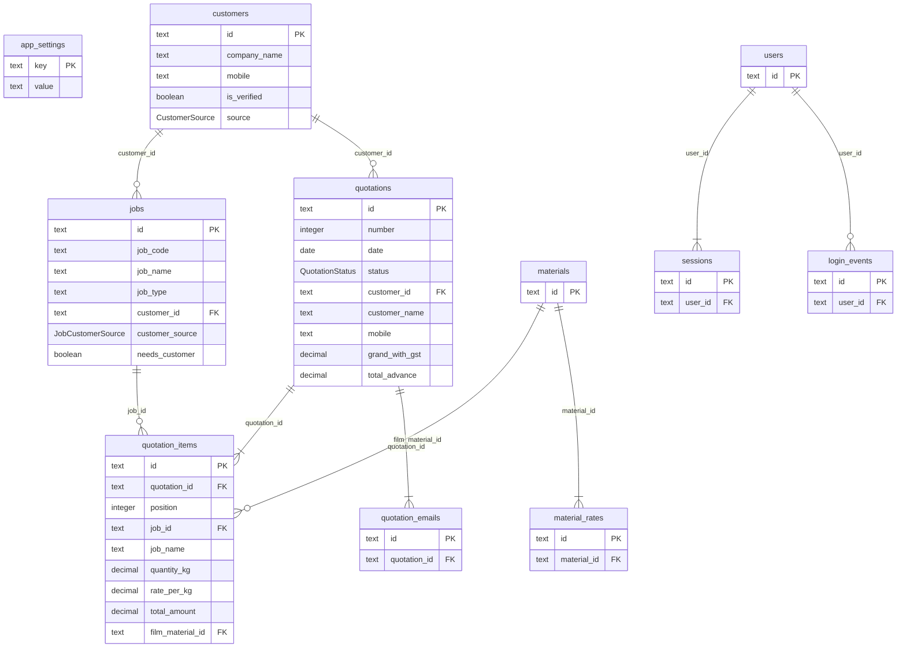

# Database schema

> Generated from the live database — do not edit by hand.
> Regenerate with `npm run schema:docs -w @yuva/api`.

## Diagram

Key columns only — `jobs` alone has 55, and a diagram showing every one is
unreadable. Full details are in the column reference below.

GitHub renders this automatically. For an interactive version you can drag
around and export as PNG or PDF, paste
[`database-schema.dbml`](./database-schema.dbml) into
[dbdiagram.io](https://dbdiagram.io/d).

## Tables

| Table | Columns | Rows | Purpose |
| --- | ---: | ---: | --- |
| `app_settings` | 3 | 0 | Editable rates: cylinder rate, GST %, advance %. |
| `customers` | 16 | 68 | Companies that order from Yuva Polyprint. |
| `jobs` | 55 | 414 | Products and their full engineering specification. |
| `login_events` | 7 | 18 |  |
| `material_rates` | 6 | 66 |  |
| `materials` | 9 | 17 |  |
| `quotation_emails` | 8 | 0 |  |
| `quotation_items` | 35 | 5 | One priced line on a quotation. |
| `quotations` | 32 | 3 | Customer-facing quotations, with totals frozen at save. |
| `sessions` | 6 | 18 |  |
| `users` | 10 | 2 |  |

## Relationships

| From | To | On delete | Meaning |
| --- | --- | --- | --- |
| `jobs.customer_id` | `customers.id` | SET NULL | A job belongs to a customer. Deleting the customer keeps the job and flags it for reassignment. |
| `quotations.customer_id` | `customers.id` | SET NULL | Links a quotation to the customer master; the printed details are snapshot on the quotation itself. |
| `quotation_items.quotation_id` | `quotations.id` | CASCADE | Lines belong to their quotation and are removed with it. |
| `quotation_items.job_id` | `jobs.id` | SET NULL | Set when a line was prefilled from a saved job spec. |
| `quotation_items.film_material_id` | `materials.id` | SET NULL |  |
| `material_rates.material_id` | `materials.id` | CASCADE |  |
| `sessions.user_id` | `users.id` | CASCADE |  |
| `quotation_emails.quotation_id` | `quotations.id` | CASCADE |  |
| `login_events.user_id` | `users.id` | SET NULL |  |

## Enums

| Type | Values |
| --- | --- |
| `CustomerSource` | `SHEET`, `BRAND_INFERRED` |
| `JobCustomerSource` | `EXPLICIT`, `INFERRED`, `NONE` |
| `JobKind` | `ROLL`, `POUCH` |
| `MaterialCategory` | `FILM`, `INK`, `ADHESIVE`, `SOLVENT`, `CONSUMABLE` |
| `PouchType` | `STANDUP`, `STANDUP_ZIPPER`, `ZIPPER`, `SPOUT`, `CENTRE_SEAL`, `THREE_SIDE_SEAL`, `OTHER` |
| `PricingBasis` | `PER_KG`, `PER_POUCH` |
| `QuotationStatus` | `DRAFT`, `SENT`, `WON`, `LOST` |

## Full column reference

### `app_settings`

| Column | Type | Null | Key |
| --- | --- | :-: | --- |
| `key` | `text` |  | PK |
| `value` | `text` |  |  |
| `updated_at` | `timestamp` |  |  |

### `customers`

| Column | Type | Null | Key |
| --- | --- | :-: | --- |
| `id` | `text` |  | PK |
| `company_name` | `text` |  | unique |
| `contact_person` | `text` |  |  |
| `address` | `text` |  |  |
| `city` | `text` |  |  |
| `district` | `text` |  |  |
| `pincode` | `text` |  |  |
| `mobile` | `text` |  |  |
| `alt_phone` | `text` |  |  |
| `email` | `text` |  |  |
| `source_raw` | `text` |  |  |
| `is_verified` | `boolean` |  |  |
| `created_at` | `timestamp` |  |  |
| `updated_at` | `timestamp` |  |  |
| `source` | `CustomerSource` (enum) |  |  |
| `gst_number` | `text` |  |  |

### `jobs`

| Column | Type | Null | Key |
| --- | --- | :-: | --- |
| `id` | `text` |  | PK |
| `job_code` | `text` |  |  |
| `job_name` | `text` |  |  |
| `job_type` | `text` |  |  |
| `customer_id` | `text` | ✓ | FK → `customers.id` |
| `pouch_type` | `text` |  |  |
| `pet_micron` | `decimal(10,3)` | ✓ |  |
| `met_pet_micron` | `decimal(10,3)` | ✓ |  |
| `poly_micron` | `decimal(10,3)` | ✓ |  |
| `poly_type` | `text` |  |  |
| `layer` | `decimal(10,3)` | ✓ |  |
| `job_final_direction` | `text` |  |  |
| `printing_type` | `text` |  |  |
| `design_height` | `decimal(10,3)` | ✓ |  |
| `design_open_width` | `decimal(10,3)` | ✓ |  |
| `ups` | `decimal(10,3)` | ✓ |  |
| `design` | `text` |  |  |
| `job_colours` | `text` |  |  |
| `total_cylinders` | `decimal(10,3)` | ✓ |  |
| `ink_gsm` | `decimal(10,3)` | ✓ |  |
| `pet_gsm` | `decimal(10,3)` | ✓ |  |
| `met_pet_gsm` | `decimal(10,3)` | ✓ |  |
| `poly_gsm` | `decimal(10,3)` | ✓ |  |
| `adhesive_gsm` | `decimal(10,3)` | ✓ |  |
| `composite_gsm` | `decimal(10,3)` | ✓ |  |
| `coating_gsm` | `decimal(10,3)` | ✓ |  |
| `up_1` | `text` |  |  |
| `up_2` | `text` |  |  |
| `up_3` | `text` |  |  |
| `up_4` | `text` |  |  |
| `up_2_open_width` | `text` |  |  |
| `up_2_height` | `text` |  |  |
| `up_3_open_width` | `text` |  |  |
| `notes` | `text` |  |  |
| `rubber_size` | `decimal(10,3)` | ✓ |  |
| `cylinder_cell` | `decimal(10,3)` | ✓ |  |
| `cylinder_dia` | `decimal(10,3)` | ✓ |  |
| `cylinder_party` | `text` |  |  |
| `viscosity` | `text` |  |  |
| `single_roll_weight` | `text` |  |  |
| `pouch_plate_size` | `text` |  |  |
| `pouches_per_kg` | `text` |  |  |
| `d_punch` | `text` |  |  |
| `d_punch_top_size` | `text` |  |  |
| `pouch_sub_type` | `text` |  |  |
| `pouch_height` | `decimal(10,3)` | ✓ |  |
| `pouch_open_width` | `decimal(10,3)` | ✓ |  |
| `gusset` | `text` |  |  |
| `gusset_size` | `text` |  |  |
| `v_notch` | `text` |  |  |
| `source_row` | `integer` |  |  |
| `created_at` | `timestamp` |  |  |
| `updated_at` | `timestamp` |  |  |
| `customer_source` | `JobCustomerSource` (enum) |  |  |
| `needs_customer` | `boolean` |  |  |

### `login_events`

| Column | Type | Null | Key |
| --- | --- | :-: | --- |
| `id` | `text` |  | PK |
| `user_id` | `text` | ✓ | FK → `users.id` |
| `username` | `text` |  |  |
| `display_name` | `text` |  |  |
| `ip_address` | `text` | ✓ |  |
| `user_agent` | `text` | ✓ |  |
| `created_at` | `timestamp` |  |  |

### `material_rates`

| Column | Type | Null | Key |
| --- | --- | :-: | --- |
| `id` | `text` |  | PK |
| `material_id` | `text` |  | FK → `materials.id` |
| `rate` | `decimal(12,4)` |  |  |
| `effective_date` | `date` |  | unique |
| `entered_by` | `text` |  |  |
| `created_at` | `timestamp` |  |  |

### `materials`

| Column | Type | Null | Key |
| --- | --- | :-: | --- |
| `id` | `text` |  | PK |
| `name` | `text` |  | unique |
| `category` | `MaterialCategory` (enum) |  |  |
| `unit` | `text` |  |  |
| `density` | `decimal(6,4)` | ✓ |  |
| `is_active` | `boolean` |  |  |
| `sort_order` | `integer` |  |  |
| `created_at` | `timestamp` |  |  |
| `updated_at` | `timestamp` |  |  |

### `quotation_emails`

| Column | Type | Null | Key |
| --- | --- | :-: | --- |
| `id` | `text` |  | PK |
| `quotation_id` | `text` |  | FK → `quotations.id` |
| `to` | `text[]` | ✓ |  |
| `cc` | `text[]` | ✓ |  |
| `subject` | `text` |  |  |
| `provider_id` | `text` | ✓ |  |
| `sent_by` | `text` |  |  |
| `created_at` | `timestamp` |  |  |

### `quotation_items`

| Column | Type | Null | Key |
| --- | --- | :-: | --- |
| `id` | `text` |  | PK |
| `quotation_id` | `text` |  | FK → `quotations.id` |
| `position` | `integer` |  |  |
| `job_id` | `text` | ✓ | FK → `jobs.id` |
| `job_name` | `text` |  |  |
| `layer` | `integer` |  |  |
| `width_mm` | `decimal(10,2)` |  |  |
| `height_mm` | `decimal(10,2)` |  |  |
| `poly_micron` | `decimal(10,2)` |  |  |
| `quantity_kg` | `decimal(12,3)` |  |  |
| `rate_per_kg` | `decimal(12,2)` |  |  |
| `repeat_width` | `decimal(10,2)` |  |  |
| `repeat_height` | `decimal(10,2)` |  |  |
| `cylinder_count` | `integer` |  |  |
| `transport_cost` | `decimal(12,2)` |  |  |
| `micron` | `decimal(10,2)` |  |  |
| `pouches_per_kg` | `decimal(12,2)` |  |  |
| `total_pouches` | `decimal(14,2)` |  |  |
| `total_amount` | `decimal(14,2)` |  |  |
| `cylinder_width` | `decimal(10,2)` |  |  |
| `cylinder_circumference` | `decimal(10,2)` |  |  |
| `cost_per_cylinder` | `decimal(14,2)` |  |  |
| `total_cylinder_cost` | `decimal(14,2)` |  |  |
| `cost_per_pouch` | `decimal(12,4)` |  |  |
| `created_at` | `timestamp` |  |  |
| `film_material_id` | `text` | ✓ | FK → `materials.id` |
| `margin_percent` | `decimal(6,2)` | ✓ |  |
| `material_cost` | `decimal(14,2)` | ✓ |  |
| `material_cost_per_kg` | `decimal(12,4)` | ✓ |  |
| `job_kind` | `JobKind` (enum) |  |  |
| `pouch_type` | `PouchType` (enum) | ✓ |  |
| `pouch_type_note` | `text` |  |  |
| `pricing_basis` | `PricingBasis` (enum) |  |  |
| `quantity_pouches` | `integer` |  |  |
| `rate_per_pouch` | `decimal(12,4)` |  |  |

### `quotations`

| Column | Type | Null | Key |
| --- | --- | :-: | --- |
| `id` | `text` |  | PK |
| `number` | `integer` |  | unique |
| `date` | `date` |  |  |
| `status` | `QuotationStatus` (enum) |  |  |
| `customer_id` | `text` | ✓ | FK → `customers.id` |
| `customer_name` | `text` |  |  |
| `address_line1` | `text` |  |  |
| `address_line2` | `text` |  |  |
| `address_line3` | `text` |  |  |
| `mobile` | `text` |  |  |
| `email` | `text` |  |  |
| `cylinder_rate` | `decimal(10,4)` |  |  |
| `gst_percent` | `decimal(5,2)` |  |  |
| `material_advance_percent` | `decimal(5,2)` |  |  |
| `cylinder_advance_percent` | `decimal(5,2)` |  |  |
| `material_subtotal` | `decimal(14,2)` |  |  |
| `material_with_gst` | `decimal(14,2)` |  |  |
| `cylinder_subtotal` | `decimal(14,2)` |  |  |
| `cylinder_with_gst` | `decimal(14,2)` |  |  |
| `grand_subtotal` | `decimal(14,2)` |  |  |
| `grand_with_gst` | `decimal(14,2)` |  |  |
| `material_advance` | `decimal(14,2)` |  |  |
| `cylinder_advance` | `decimal(14,2)` |  |  |
| `total_advance` | `decimal(14,2)` |  |  |
| `terms` | `text[]` | ✓ |  |
| `notes` | `text` |  |  |
| `sent_at` | `timestamp` | ✓ |  |
| `created_at` | `timestamp` |  |  |
| `updated_at` | `timestamp` |  |  |
| `gst_number` | `text` |  |  |
| `decided_at` | `timestamp` | ✓ |  |
| `lost_reason` | `text` |  |  |

### `sessions`

| Column | Type | Null | Key |
| --- | --- | :-: | --- |
| `id` | `text` |  | PK |
| `token_hash` | `text` |  | unique |
| `user_id` | `text` |  | FK → `users.id` |
| `expires_at` | `timestamp` |  |  |
| `last_seen_at` | `timestamp` |  |  |
| `created_at` | `timestamp` |  |  |

### `users`

| Column | Type | Null | Key |
| --- | --- | :-: | --- |
| `id` | `text` |  | PK |
| `username` | `text` |  | unique |
| `password_hash` | `text` |  |  |
| `display_name` | `text` |  |  |
| `is_admin` | `boolean` |  |  |
| `is_active` | `boolean` |  |  |
| `modules` | `text[]` | ✓ |  |
| `last_login_at` | `timestamp` | ✓ |  |
| `created_at` | `timestamp` |  |  |
| `updated_at` | `timestamp` |  |  |

