# Database schema

> Generated from the live database — do not edit by hand.
> Regenerate with `npm run schema:docs -w @yuva/api`.

## Diagram

Key columns only — `jobs` alone has 55, and a diagram showing every one is
unreadable. Full details are in the column reference below.

GitHub renders this automatically. For an interactive version you can drag
around and export as PNG or PDF, paste
[`database-schema.dbml`](./database-schema.dbml) into
[dbdiagram.io](https://dbdiagram.io/d).

```mermaid
erDiagram
  app_setting_history {
    text key PK
    text value
    date effective_date PK
  }
  app_settings {
    text key PK
    text value
  }
  costing_labour {
    text id PK
  }
  costing_machines {
    text id PK
  }
  costing_overheads {
    text id PK
  }
  customers {
    text id PK
    text company_name
    text mobile
    boolean is_verified
    CustomerSource source
  }
  cylinder_events {
    text id PK
    text cylinder_id FK
  }
  cylinders {
    text id PK
    text job_id FK
    integer position
    CylinderStatus status
  }
  job_artwork {
    text id PK
    text job_id FK
    ArtworkStatus status
    text replaces_id FK
  }
  job_sheet_labour {
    text id PK
    text sheet_id FK
    integer position
  }
  job_sheet_lines {
    text id PK
    text sheet_id FK
    integer position
    text material_id FK
    decimal rate_per_kg
  }
  job_sheet_stage_usage {
    text id PK
    text sheet_id FK
  }
  job_sheets {
    text id PK
    integer number
    date date
    JobSheetStatus status
    text job_id FK
    text job_name
    text customer_id FK
  }
  jobs {
    text id PK
    text job_code
    text job_name
    text job_type
    text customer_id FK
    JobCustomerSource customer_source
    boolean needs_customer
  }
  login_events {
    text id PK
    text user_id FK
  }
  material_rates {
    text id PK
    text material_id FK
  }
  materials {
    text id PK
  }
  orders {
    text id PK
    integer number
    OrderStatus status
    text customer_id FK
    text customer_name
    text job_id FK
    text job_name
    text quotation_id FK
    text quotation_item_id FK
    decimal quantity_kg
    decimal rate_per_kg
  }
  purchase_order_lines {
    text id PK
    text order_id FK
    integer position
    text material_id FK
  }
  purchase_orders {
    text id PK
    integer number
    text supplier_id FK
    PurchaseOrderStatus status
  }
  purchase_receipts {
    text id PK
    text line_id FK
    text order_id FK
    text batch_id FK
  }
  quotation_emails {
    text id PK
    text quotation_id FK
  }
  quotation_item_colours {
    text id PK
    text item_id FK
    integer position
    text material_id FK
    decimal rate_per_kg
  }
  quotation_item_layers {
    text id PK
    text item_id FK
    integer position
    text material_id FK
    decimal rate_per_kg
  }
  quotation_item_quantities {
    text id PK
    text item_id FK
    text tier_id FK
    integer position
    decimal quantity_kg
    decimal rate_per_kg
    decimal total_amount
  }
  quotation_items {
    text id PK
    text quotation_id FK
    integer position
    text job_id FK
    text job_name
  }
  quotation_tiers {
    text id PK
    text quotation_id FK
    integer position
    decimal grand_with_gst
    decimal total_advance
  }
  quotations {
    text id PK
    integer number
    date date
    QuotationStatus status
    text customer_id FK
    text customer_name
    text mobile
    text root_id FK
    text won_tier_id FK
  }
  sessions {
    text id PK
    text user_id FK
  }
  stock_batches {
    text id PK
    text material_id FK
  }
  stock_movements {
    text id PK
    text batch_id FK
    text material_id FK
    text job_id FK
  }
  suppliers {
    text id PK
    text mobile
  }
  users {
    text id PK
  }
  customers ||--o{ jobs : "customer_id"
  customers ||--o{ quotations : "customer_id"
  quotations ||--|{ quotation_items : "quotation_id"
  jobs ||--o{ quotation_items : "job_id"
  materials ||--|{ material_rates : "material_id"
  users ||--|{ sessions : "user_id"
  quotations ||--|{ quotation_emails : "quotation_id"
  users ||--o{ login_events : "user_id"
  quotations ||--o{ quotations : "root_id"
  quotation_tiers ||--o{ quotations : "won_tier_id"
  quotations ||--|{ quotation_tiers : "quotation_id"
  quotation_items ||--|{ quotation_item_layers : "item_id"
  materials ||--o{ quotation_item_layers : "material_id"
  quotation_items ||--|{ quotation_item_quantities : "item_id"
  quotation_tiers ||--|{ quotation_item_quantities : "tier_id"
  materials ||--|{ stock_batches : "material_id"
  stock_batches ||--|{ stock_movements : "batch_id"
  materials ||--|{ stock_movements : "material_id"
  jobs ||--o{ stock_movements : "job_id"
  suppliers ||--|{ purchase_orders : "supplier_id"
  purchase_orders ||--|{ purchase_order_lines : "order_id"
  materials ||--|{ purchase_order_lines : "material_id"
  purchase_order_lines ||--|{ purchase_receipts : "line_id"
  purchase_orders ||--|{ purchase_receipts : "order_id"
  stock_batches ||--o{ purchase_receipts : "batch_id"
  jobs ||--|{ cylinders : "job_id"
  cylinders ||--|{ cylinder_events : "cylinder_id"
  jobs ||--|{ job_artwork : "job_id"
  job_artwork ||--o{ job_artwork : "replaces_id"
  quotation_items ||--|{ quotation_item_colours : "item_id"
  materials ||--o{ quotation_item_colours : "material_id"
  jobs ||--o{ job_sheets : "job_id"
  customers ||--o{ job_sheets : "customer_id"
  job_sheets ||--|{ job_sheet_lines : "sheet_id"
  materials ||--o{ job_sheet_lines : "material_id"
  job_sheets ||--|{ job_sheet_labour : "sheet_id"
  job_sheets ||--|{ job_sheet_stage_usage : "sheet_id"
  customers ||--o{ orders : "customer_id"
  jobs ||--o{ orders : "job_id"
  quotations ||--o{ orders : "quotation_id"
  quotation_items ||--o{ orders : "quotation_item_id"
```

## Tables

| Table | Columns | Rows | Purpose |
| --- | ---: | ---: | --- |
| `app_setting_history` | 4 | 66 |  |
| `app_settings` | 3 | 61 | Editable rates: cylinder rate, GST %, advance %. |
| `costing_labour` | 8 | 7 |  |
| `costing_machines` | 14 | 4 |  |
| `costing_overheads` | 9 | 0 |  |
| `customers` | 17 | 70 | Companies that order from Yuva Polyprint. |
| `cylinder_events` | 11 | 0 |  |
| `cylinders` | 16 | 0 |  |
| `job_artwork` | 17 | 0 |  |
| `job_sheet_labour` | 8 | 120 |  |
| `job_sheet_lines` | 17 | 315 |  |
| `job_sheet_stage_usage` | 7 | 75 |  |
| `job_sheets` | 59 | 15 |  |
| `jobs` | 55 | 419 | Products and their full engineering specification. |
| `login_events` | 7 | 49 |  |
| `material_rates` | 6 | 405 |  |
| `materials` | 13 | 24 |  |
| `orders` | 23 | 0 |  |
| `purchase_order_lines` | 9 | 2 |  |
| `purchase_orders` | 10 | 1 |  |
| `purchase_receipts` | 11 | 1 |  |
| `quotation_emails` | 10 | 1 |  |
| `quotation_item_colours` | 9 | 4 |  |
| `quotation_item_layers` | 10 | 2 |  |
| `quotation_item_quantities` | 13 | 3 |  |
| `quotation_items` | 31 | 1 | One priced line on a quotation. |
| `quotation_tiers` | 14 | 3 |  |
| `quotations` | 33 | 1 | Customer-facing quotations, with totals frozen at save. |
| `sessions` | 6 | 9 |  |
| `stock_batches` | 14 | 1 |  |
| `stock_movements` | 13 | 5 |  |
| `suppliers` | 11 | 1 |  |
| `users` | 10 | 3 |  |

## Relationships

| From | To | On delete | Meaning |
| --- | --- | --- | --- |
| `jobs.customer_id` | `customers.id` | SET NULL | A job belongs to a customer. Deleting the customer keeps the job and flags it for reassignment. |
| `quotations.customer_id` | `customers.id` | SET NULL | Links a quotation to the customer master; the printed details are snapshot on the quotation itself. |
| `quotation_items.quotation_id` | `quotations.id` | CASCADE | Lines belong to their quotation and are removed with it. |
| `quotation_items.job_id` | `jobs.id` | SET NULL | Set when a line was prefilled from a saved job spec. |
| `material_rates.material_id` | `materials.id` | CASCADE |  |
| `sessions.user_id` | `users.id` | CASCADE |  |
| `quotation_emails.quotation_id` | `quotations.id` | CASCADE |  |
| `login_events.user_id` | `users.id` | SET NULL |  |
| `quotations.root_id` | `quotations.id` | CASCADE |  |
| `quotations.won_tier_id` | `quotation_tiers.id` | SET NULL |  |
| `quotation_tiers.quotation_id` | `quotations.id` | CASCADE |  |
| `quotation_item_layers.item_id` | `quotation_items.id` | CASCADE |  |
| `quotation_item_layers.material_id` | `materials.id` | SET NULL |  |
| `quotation_item_quantities.item_id` | `quotation_items.id` | CASCADE |  |
| `quotation_item_quantities.tier_id` | `quotation_tiers.id` | CASCADE |  |
| `stock_batches.material_id` | `materials.id` | RESTRICT |  |
| `stock_movements.batch_id` | `stock_batches.id` | CASCADE |  |
| `stock_movements.material_id` | `materials.id` | RESTRICT |  |
| `stock_movements.job_id` | `jobs.id` | SET NULL |  |
| `purchase_orders.supplier_id` | `suppliers.id` | RESTRICT |  |
| `purchase_order_lines.order_id` | `purchase_orders.id` | CASCADE |  |
| `purchase_order_lines.material_id` | `materials.id` | RESTRICT |  |
| `purchase_receipts.line_id` | `purchase_order_lines.id` | CASCADE |  |
| `purchase_receipts.order_id` | `purchase_orders.id` | CASCADE |  |
| `purchase_receipts.batch_id` | `stock_batches.id` | SET NULL |  |
| `cylinders.job_id` | `jobs.id` | RESTRICT |  |
| `cylinder_events.cylinder_id` | `cylinders.id` | CASCADE |  |
| `job_artwork.job_id` | `jobs.id` | CASCADE |  |
| `job_artwork.replaces_id` | `job_artwork.id` | RESTRICT |  |
| `quotation_item_colours.item_id` | `quotation_items.id` | CASCADE |  |
| `quotation_item_colours.material_id` | `materials.id` | SET NULL |  |
| `job_sheets.job_id` | `jobs.id` | SET NULL |  |
| `job_sheets.customer_id` | `customers.id` | SET NULL |  |
| `job_sheet_lines.sheet_id` | `job_sheets.id` | CASCADE |  |
| `job_sheet_lines.material_id` | `materials.id` | SET NULL |  |
| `job_sheet_labour.sheet_id` | `job_sheets.id` | CASCADE |  |
| `job_sheet_stage_usage.sheet_id` | `job_sheets.id` | CASCADE |  |
| `orders.customer_id` | `customers.id` | SET NULL |  |
| `orders.job_id` | `jobs.id` | SET NULL |  |
| `orders.quotation_id` | `quotations.id` | SET NULL |  |
| `orders.quotation_item_id` | `quotation_items.id` | SET NULL |  |

## Enums

| Type | Values |
| --- | --- |
| `ArtworkKind` | `ARTWORK`, `PROOF`, `REFERENCE`, `OTHER` |
| `ArtworkStatus` | `PENDING`, `ACTIVE`, `SUPERSEDED`, `REMOVED`, `DELETED` |
| `CustomerSource` | `SHEET`, `BRAND_INFERRED` |
| `CylinderEventKind` | `ENGRAVED`, `ALLOCATED`, `IN_USE`, `RETURNED`, `DAMAGED`, `REWORKED`, `TRANSFERRED`, `RETIRED` |
| `CylinderOwnership` | `CUSTOMER_OWNED`, `YUVA_OWNED` |
| `CylinderStatus` | `IN_STORE`, `ALLOCATED`, `IN_USE`, `DAMAGED`, `NEEDS_REWORK`, `RETIRED` |
| `InkKind` | `PROCESS`, `SPECIAL` |
| `JobCustomerSource` | `EXPLICIT`, `INFERRED`, `NONE` |
| `JobKind` | `ROLL`, `POUCH` |
| `JobSheetLineKind` | `FILM`, `SOLVENT`, `INK`, `ADHESIVE`, `OTHER` |
| `JobSheetSection` | `PRINTING`, `LAMINATION` |
| `JobSheetStage` | `PRINTING`, `LAMINATION_1`, `LAMINATION_2`, `SLITTING`, `POUCHING` |
| `JobSheetStatus` | `OPEN`, `COSTED`, `CLOSED` |
| `MachineKind` | `PRINTING`, `LAMINATION`, `SLITTING`, `POUCHING` |
| `MaterialCategory` | `FILM`, `INK`, `ADHESIVE`, `SOLVENT`, `CONSUMABLE` |
| `OrderStatus` | `CONFIRMED`, `IN_PRODUCTION`, `COMPLETED`, `CANCELLED` |
| `OverheadBasis` | `PER_KG`, `PER_JOB`, `PER_POUCH`, `PER_DAY`, `PERCENT_MATERIAL`, `PERCENT_TOTAL` |
| `PouchType` | `STANDUP`, `STANDUP_ZIPPER`, `ZIPPER`, `D_PUNCH`, `SPOUT`, `CENTRE_SEAL`, `THREE_SIDE_SEAL`, `OTHER` |
| `PricingBasis` | `PER_KG`, `PER_POUCH` |
| `PurchaseOrderStatus` | `ORDERED`, `IN_TRANSIT`, `PARTIALLY_RECEIVED`, `RECEIVED`, `CANCELLED` |
| `QuotationStatus` | `DRAFT`, `SENT`, `WON`, `LOST` |
| `StockMovementKind` | `RECEIPT`, `ISSUE`, `WASTE`, `ADJUSTMENT`, `TRANSFER` |

## Full column reference

### `app_setting_history`

| Column | Type | Null | Key |
| --- | --- | :-: | --- |
| `key` | `text` |  | PK |
| `value` | `text` |  |  |
| `effective_date` | `date` |  | PK |
| `created_at` | `timestamp` |  |  |

### `app_settings`

| Column | Type | Null | Key |
| --- | --- | :-: | --- |
| `key` | `text` |  | PK |
| `value` | `text` |  |  |
| `updated_at` | `timestamp` |  |  |

### `costing_labour`

| Column | Type | Null | Key |
| --- | --- | :-: | --- |
| `id` | `text` |  | PK |
| `role` | `text` |  | unique |
| `process` | `MachineKind` (enum) |  |  |
| `monthly_salary` | `decimal(12,2)` |  |  |
| `is_active` | `boolean` |  |  |
| `sort_order` | `integer` |  |  |
| `created_at` | `timestamp` |  |  |
| `updated_at` | `timestamp` |  |  |

### `costing_machines`

| Column | Type | Null | Key |
| --- | --- | :-: | --- |
| `id` | `text` |  | PK |
| `name` | `text` |  | unique |
| `kind` | `MachineKind` (enum) |  |  |
| `horsepower` | `decimal(10,2)` |  |  |
| `power_rate_per_hp_hour` | `decimal(10,2)` |  |  |
| `speed_m_per_min` | `decimal(10,2)` |  |  |
| `setup_minutes` | `integer` |  |  |
| `is_active` | `boolean` |  |  |
| `sort_order` | `integer` |  |  |
| `created_at` | `timestamp` |  |  |
| `updated_at` | `timestamp` |  |  |
| `setup_power_factor` | `decimal(4,3)` |  |  |
| `station_horsepower` | `decimal(10,2)` |  |  |
| `station_colour_steps` | `text` |  |  |

### `costing_overheads`

| Column | Type | Null | Key |
| --- | --- | :-: | --- |
| `id` | `text` |  | PK |
| `name` | `text` |  |  |
| `basis` | `OverheadBasis` (enum) |  |  |
| `amount` | `decimal(12,4)` |  |  |
| `effective_from` | `date` |  |  |
| `effective_to` | `date` | ✓ |  |
| `sort_order` | `integer` |  |  |
| `created_at` | `timestamp` |  |  |
| `updated_at` | `timestamp` |  |  |

### `customers`

| Column | Type | Null | Key |
| --- | --- | :-: | --- |
| `id` | `text` |  | PK |
| `company_name` | `text` |  | unique |
| `contact_person` | `text` |  |  |
| `address` | `text` |  |  |
| `city` | `text` |  |  |
| `district` | `text` |  |  |
| `pincode` | `text` |  |  |
| `mobile` | `text` |  |  |
| `alt_phone` | `text` |  |  |
| `email` | `text` |  |  |
| `source_raw` | `text` |  |  |
| `is_verified` | `boolean` |  |  |
| `created_at` | `timestamp` |  |  |
| `updated_at` | `timestamp` |  |  |
| `source` | `CustomerSource` (enum) |  |  |
| `gst_number` | `text` |  |  |
| `brand_name` | `text` |  |  |

### `cylinder_events`

| Column | Type | Null | Key |
| --- | --- | :-: | --- |
| `id` | `text` |  | PK |
| `cylinder_id` | `text` |  | FK → `cylinders.id` |
| `kind` | `CylinderEventKind` (enum) |  |  |
| `occurred_on` | `date` |  |  |
| `status_after` | `CylinderStatus` (enum) |  |  |
| `reference` | `text` |  |  |
| `from_location` | `text` |  |  |
| `to_location` | `text` |  |  |
| `notes` | `text` |  |  |
| `entered_by` | `text` |  |  |
| `created_at` | `timestamp` |  |  |

### `cylinders`

| Column | Type | Null | Key |
| --- | --- | :-: | --- |
| `id` | `text` |  | PK |
| `code` | `text` |  | unique |
| `job_id` | `text` |  | FK → `jobs.id` |
| `colour` | `text` |  |  |
| `position` | `integer` | ✓ |  |
| `ownership` | `CylinderOwnership` (enum) |  |  |
| `status` | `CylinderStatus` (enum) |  |  |
| `location` | `text` |  |  |
| `diameter_mm` | `decimal(10,2)` | ✓ |  |
| `circumference_mm` | `decimal(10,2)` | ✓ |  |
| `cost` | `decimal(12,2)` | ✓ |  |
| `engraver` | `text` |  |  |
| `engraved_on` | `date` | ✓ |  |
| `notes` | `text` |  |  |
| `created_at` | `timestamp` |  |  |
| `updated_at` | `timestamp` |  |  |

### `job_artwork`

| Column | Type | Null | Key |
| --- | --- | :-: | --- |
| `id` | `text` |  | PK |
| `job_id` | `text` |  | FK → `jobs.id` |
| `kind` | `ArtworkKind` (enum) |  |  |
| `status` | `ArtworkStatus` (enum) |  |  |
| `storage_key` | `text` | ✓ | unique |
| `filename` | `text` |  |  |
| `content_type` | `text` |  |  |
| `size_bytes` | `integer` |  |  |
| `version` | `integer` |  |  |
| `replaces_id` | `text` | ✓ | FK → `job_artwork.id` |
| `notes` | `text` |  |  |
| `uploaded_by` | `text` |  |  |
| `uploaded_at` | `timestamp` | ✓ |  |
| `created_at` | `timestamp` |  |  |
| `updated_at` | `timestamp` |  |  |
| `deleted_at` | `timestamp` | ✓ |  |
| `deleted_by` | `text` | ✓ |  |

### `job_sheet_labour`

| Column | Type | Null | Key |
| --- | --- | :-: | --- |
| `id` | `text` |  | PK |
| `sheet_id` | `text` |  | FK → `job_sheets.id` |
| `position` | `integer` |  | unique |
| `role` | `text` |  |  |
| `headcount` | `decimal(8,2)` |  |  |
| `rate_per_day` | `decimal(10,2)` |  |  |
| `days` | `decimal(8,3)` |  |  |
| `amount` | `decimal(12,2)` |  |  |

### `job_sheet_lines`

| Column | Type | Null | Key |
| --- | --- | :-: | --- |
| `id` | `text` |  | PK |
| `sheet_id` | `text` |  | FK → `job_sheets.id` |
| `position` | `integer` |  | unique |
| `section` | `JobSheetSection` (enum) |  |  |
| `kind` | `JobSheetLineKind` (enum) |  |  |
| `material_id` | `text` | ✓ | FK → `materials.id` |
| `name` | `text` |  |  |
| `issued_kg` | `decimal(14,3)` |  |  |
| `returned_kg` | `decimal(14,3)` |  |  |
| `mix_issued_kg` | `decimal(14,3)` |  |  |
| `mix_returned_kg` | `decimal(14,3)` |  |  |
| `mix_share_percent` | `decimal(6,3)` |  |  |
| `computed_kg` | `decimal(14,3)` |  |  |
| `consumed_override_kg` | `decimal(14,3)` | ✓ |  |
| `consumed_kg` | `decimal(14,3)` |  |  |
| `rate_per_kg` | `decimal(12,4)` |  |  |
| `amount` | `decimal(14,2)` |  |  |

### `job_sheet_stage_usage`

| Column | Type | Null | Key |
| --- | --- | :-: | --- |
| `id` | `text` |  | PK |
| `sheet_id` | `text` |  | FK → `job_sheets.id` |
| `stage` | `JobSheetStage` (enum) |  | unique |
| `share_percent` | `decimal(6,3)` |  |  |
| `days` | `decimal(8,3)` |  |  |
| `shifts` | `decimal(6,2)` |  |  |
| `amount` | `decimal(12,2)` |  |  |

### `job_sheets`

| Column | Type | Null | Key |
| --- | --- | :-: | --- |
| `id` | `text` |  | PK |
| `number` | `integer` |  | unique |
| `date` | `date` |  |  |
| `status` | `JobSheetStatus` (enum) |  |  |
| `job_id` | `text` | ✓ | FK → `jobs.id` |
| `job_name` | `text` |  |  |
| `customer_id` | `text` | ✓ | FK → `customers.id` |
| `operator_name` | `text` |  |  |
| `film_type` | `text` |  |  |
| `web_width_mm` | `decimal(10,2)` | ✓ |  |
| `micron` | `decimal(10,3)` | ✓ |  |
| `circumference_mm` | `decimal(10,2)` | ✓ |  |
| `cylinder_count` | `integer` |  |  |
| `print_mix_issued_kg` | `decimal(14,3)` |  |  |
| `print_mix_returned_kg` | `decimal(14,3)` |  |  |
| `lam_mix_issued_kg` | `decimal(14,3)` |  |  |
| `lam_mix_returned_kg` | `decimal(14,3)` |  |  |
| `make_ready_days` | `decimal(8,3)` |  |  |
| `production_days` | `decimal(8,3)` |  |  |
| `printed_gross_kg` | `decimal(14,3)` |  |  |
| `printed_core_kg` | `decimal(14,3)` |  |  |
| `produced_gross_kg` | `decimal(14,3)` |  |  |
| `produced_core_kg` | `decimal(14,3)` |  |  |
| `final_output_kg` | `decimal(14,3)` |  |  |
| `pouching_weight_kg` | `decimal(14,3)` |  |  |
| `electricity_per_day` | `decimal(12,2)` |  |  |
| `transport_per_kg` | `decimal(10,4)` |  |  |
| `pouching_per_kg` | `decimal(10,4)` |  |  |
| `packaging_cost` | `decimal(12,2)` |  |  |
| `emi_per_day` | `decimal(12,2)` |  |  |
| `profit_percent` | `decimal(6,3)` |  |  |
| `expected_wastage_percent` | `decimal(6,3)` |  |  |
| `electricity_override` | `decimal(12,2)` | ✓ |  |
| `salary_override` | `decimal(12,2)` | ✓ |  |
| `transport_override` | `decimal(12,2)` | ✓ |  |
| `pouching_override` | `decimal(12,2)` | ✓ |  |
| `emi_override` | `decimal(12,2)` | ✓ |  |
| `profit_override` | `decimal(12,2)` | ✓ |  |
| `material_kg` | `decimal(14,3)` |  |  |
| `material_cost` | `decimal(14,2)` |  |  |
| `basic_value_per_kg` | `decimal(12,2)` |  |  |
| `electricity_cost` | `decimal(12,2)` |  |  |
| `salary_cost` | `decimal(12,2)` |  |  |
| `transport_cost` | `decimal(12,2)` |  |  |
| `pouching_cost` | `decimal(12,2)` |  |  |
| `emi_cost` | `decimal(12,2)` |  |  |
| `profit` | `decimal(12,2)` |  |  |
| `overhead_cost` | `decimal(14,2)` |  |  |
| `effective_price` | `decimal(14,2)` |  |  |
| `cost_per_kg` | `decimal(12,2)` |  |  |
| `expected_wastage_kg` | `decimal(14,3)` |  |  |
| `actual_wastage_kg` | `decimal(14,3)` |  |  |
| `wastage_percent` | `decimal(8,3)` |  |  |
| `excess_cost` | `decimal(14,2)` |  |  |
| `stock_posted_at` | `timestamp` | ✓ |  |
| `notes` | `text` |  |  |
| `entered_by` | `text` |  |  |
| `created_at` | `timestamp` |  |  |
| `updated_at` | `timestamp` |  |  |

### `jobs`

| Column | Type | Null | Key |
| --- | --- | :-: | --- |
| `id` | `text` |  | PK |
| `job_code` | `text` |  |  |
| `job_name` | `text` |  |  |
| `job_type` | `text` |  |  |
| `customer_id` | `text` | ✓ | FK → `customers.id` |
| `pouch_type` | `text` |  |  |
| `pet_micron` | `decimal(10,3)` | ✓ |  |
| `met_pet_micron` | `decimal(10,3)` | ✓ |  |
| `poly_micron` | `decimal(10,3)` | ✓ |  |
| `poly_type` | `text` |  |  |
| `layer` | `decimal(10,3)` | ✓ |  |
| `job_final_direction` | `text` |  |  |
| `printing_type` | `text` |  |  |
| `design_height` | `decimal(10,3)` | ✓ |  |
| `design_open_width` | `decimal(10,3)` | ✓ |  |
| `ups` | `decimal(10,3)` | ✓ |  |
| `design` | `text` |  |  |
| `job_colours` | `text` |  |  |
| `total_cylinders` | `decimal(10,3)` | ✓ |  |
| `ink_gsm` | `decimal(10,3)` | ✓ |  |
| `pet_gsm` | `decimal(10,3)` | ✓ |  |
| `met_pet_gsm` | `decimal(10,3)` | ✓ |  |
| `poly_gsm` | `decimal(10,3)` | ✓ |  |
| `adhesive_gsm` | `decimal(10,3)` | ✓ |  |
| `composite_gsm` | `decimal(10,3)` | ✓ |  |
| `coating_gsm` | `decimal(10,3)` | ✓ |  |
| `up_1` | `text` |  |  |
| `up_2` | `text` |  |  |
| `up_3` | `text` |  |  |
| `up_4` | `text` |  |  |
| `up_2_open_width` | `text` |  |  |
| `up_2_height` | `text` |  |  |
| `up_3_open_width` | `text` |  |  |
| `notes` | `text` |  |  |
| `rubber_size` | `decimal(10,3)` | ✓ |  |
| `cylinder_cell` | `decimal(10,3)` | ✓ |  |
| `cylinder_dia` | `decimal(10,3)` | ✓ |  |
| `cylinder_party` | `text` |  |  |
| `viscosity` | `text` |  |  |
| `single_roll_weight` | `text` |  |  |
| `pouch_plate_size` | `text` |  |  |
| `pouches_per_kg` | `text` |  |  |
| `d_punch` | `text` |  |  |
| `d_punch_top_size` | `text` |  |  |
| `pouch_sub_type` | `text` |  |  |
| `pouch_height` | `decimal(10,3)` | ✓ |  |
| `pouch_open_width` | `decimal(10,3)` | ✓ |  |
| `gusset` | `text` |  |  |
| `gusset_size` | `text` |  |  |
| `v_notch` | `text` |  |  |
| `source_row` | `integer` |  |  |
| `created_at` | `timestamp` |  |  |
| `updated_at` | `timestamp` |  |  |
| `customer_source` | `JobCustomerSource` (enum) |  |  |
| `needs_customer` | `boolean` |  |  |

### `login_events`

| Column | Type | Null | Key |
| --- | --- | :-: | --- |
| `id` | `text` |  | PK |
| `user_id` | `text` | ✓ | FK → `users.id` |
| `username` | `text` |  |  |
| `display_name` | `text` |  |  |
| `ip_address` | `text` | ✓ |  |
| `user_agent` | `text` | ✓ |  |
| `created_at` | `timestamp` |  |  |

### `material_rates`

| Column | Type | Null | Key |
| --- | --- | :-: | --- |
| `id` | `text` |  | PK |
| `material_id` | `text` |  | FK → `materials.id` |
| `rate` | `decimal(12,4)` |  |  |
| `effective_date` | `date` |  | unique |
| `entered_by` | `text` |  |  |
| `created_at` | `timestamp` |  |  |

### `materials`

| Column | Type | Null | Key |
| --- | --- | :-: | --- |
| `id` | `text` |  | PK |
| `name` | `text` |  | unique |
| `category` | `MaterialCategory` (enum) |  |  |
| `unit` | `text` |  |  |
| `density` | `decimal(6,4)` | ✓ |  |
| `is_active` | `boolean` |  |  |
| `sort_order` | `integer` |  |  |
| `created_at` | `timestamp` |  |  |
| `updated_at` | `timestamp` |  |  |
| `reorder_level` | `decimal(14,3)` | ✓ |  |
| `laydown_gsm` | `decimal(6,3)` | ✓ |  |
| `solids_percent` | `decimal(6,3)` | ✓ |  |
| `ink_kind` | `InkKind` (enum) | ✓ |  |

### `orders`

| Column | Type | Null | Key |
| --- | --- | :-: | --- |
| `id` | `text` |  | PK |
| `number` | `integer` |  | unique |
| `status` | `OrderStatus` (enum) |  |  |
| `customer_id` | `text` | ✓ | FK → `customers.id` |
| `customer_name` | `text` |  |  |
| `job_id` | `text` | ✓ | FK → `jobs.id` |
| `job_name` | `text` |  |  |
| `quotation_id` | `text` | ✓ | FK → `quotations.id` |
| `quotation_item_id` | `text` | ✓ | FK → `quotation_items.id` |
| `quantity_kg` | `decimal(12,3)` |  |  |
| `rate_per_kg` | `decimal(12,2)` |  |  |
| `quantity_pouches` | `integer` |  |  |
| `rate_per_pouch` | `decimal(12,4)` |  |  |
| `amount` | `decimal(14,2)` |  |  |
| `customer_po_number` | `text` |  |  |
| `order_date` | `date` |  |  |
| `due_date` | `date` | ✓ |  |
| `notes` | `text` |  |  |
| `completed_at` | `timestamp` | ✓ |  |
| `cancelled_at` | `timestamp` | ✓ |  |
| `cancelled_reason` | `text` |  |  |
| `created_at` | `timestamp` |  |  |
| `updated_at` | `timestamp` |  |  |

### `purchase_order_lines`

| Column | Type | Null | Key |
| --- | --- | :-: | --- |
| `id` | `text` |  | PK |
| `order_id` | `text` |  | FK → `purchase_orders.id` |
| `position` | `integer` |  | unique |
| `material_id` | `text` |  | FK → `materials.id` |
| `quantity` | `decimal(14,3)` |  |  |
| `unit` | `text` |  |  |
| `rate_per_unit` | `decimal(12,4)` |  |  |
| `closed_at` | `timestamp` | ✓ |  |
| `closed_reason` | `text` |  |  |

### `purchase_orders`

| Column | Type | Null | Key |
| --- | --- | :-: | --- |
| `id` | `text` |  | PK |
| `number` | `integer` |  | unique |
| `supplier_id` | `text` |  | FK → `suppliers.id` |
| `status` | `PurchaseOrderStatus` (enum) |  |  |
| `ordered_on` | `date` |  |  |
| `expected_on` | `date` | ✓ |  |
| `notes` | `text` |  |  |
| `raised_by` | `text` |  |  |
| `created_at` | `timestamp` |  |  |
| `updated_at` | `timestamp` |  |  |

### `purchase_receipts`

| Column | Type | Null | Key |
| --- | --- | :-: | --- |
| `id` | `text` |  | PK |
| `line_id` | `text` |  | FK → `purchase_order_lines.id` |
| `order_id` | `text` |  | FK → `purchase_orders.id` |
| `received_on` | `date` |  |  |
| `accepted_quantity` | `decimal(14,3)` |  |  |
| `rejected_quantity` | `decimal(14,3)` |  |  |
| `rejection_reason` | `text` |  |  |
| `batch_id` | `text` | ✓ | FK → `stock_batches.id` |
| `notes` | `text` |  |  |
| `entered_by` | `text` |  |  |
| `created_at` | `timestamp` |  |  |

### `quotation_emails`

| Column | Type | Null | Key |
| --- | --- | :-: | --- |
| `id` | `text` |  | PK |
| `quotation_id` | `text` |  | FK → `quotations.id` |
| `to` | `text[]` | ✓ |  |
| `cc` | `text[]` | ✓ |  |
| `subject` | `text` |  |  |
| `provider_id` | `text` | ✓ |  |
| `sent_by` | `text` |  |  |
| `created_at` | `timestamp` |  |  |
| `whatsapp_to` | `text[]` |  |  |
| `whatsapp_sent_at` | `timestamp` | ✓ |  |

### `quotation_item_colours`

| Column | Type | Null | Key |
| --- | --- | :-: | --- |
| `id` | `text` |  | PK |
| `item_id` | `text` |  | FK → `quotation_items.id` |
| `position` | `integer` |  | unique |
| `material_id` | `text` | ✓ | FK → `materials.id` |
| `name` | `text` |  |  |
| `kind` | `InkKind` (enum) |  |  |
| `laydown_gsm` | `decimal(6,3)` |  |  |
| `solids_percent` | `decimal(6,3)` |  |  |
| `rate_per_kg` | `decimal(12,2)` |  |  |

### `quotation_item_layers`

| Column | Type | Null | Key |
| --- | --- | :-: | --- |
| `id` | `text` |  | PK |
| `item_id` | `text` |  | FK → `quotation_items.id` |
| `position` | `integer` |  | unique |
| `material_id` | `text` | ✓ | FK → `materials.id` |
| `material_name` | `text` |  |  |
| `micron` | `decimal(10,2)` |  |  |
| `density` | `decimal(6,4)` | ✓ |  |
| `rate_per_kg` | `decimal(12,2)` | ✓ |  |
| `gsm` | `decimal(10,3)` |  |  |
| `rate_override` | `decimal(12,2)` | ✓ |  |

### `quotation_item_quantities`

| Column | Type | Null | Key |
| --- | --- | :-: | --- |
| `id` | `text` |  | PK |
| `item_id` | `text` |  | FK → `quotation_items.id` |
| `tier_id` | `text` |  | FK → `quotation_tiers.id` |
| `position` | `integer` |  | unique |
| `quantity_kg` | `decimal(12,3)` |  |  |
| `rate_per_kg` | `decimal(12,2)` |  |  |
| `quantity_pouches` | `integer` |  |  |
| `rate_per_pouch` | `decimal(12,4)` |  |  |
| `total_pouches` | `decimal(14,2)` |  |  |
| `total_amount` | `decimal(14,2)` |  |  |
| `cost_per_pouch` | `decimal(12,4)` |  |  |
| `material_cost` | `decimal(14,2)` | ✓ |  |
| `margin_percent` | `decimal(6,2)` | ✓ |  |

### `quotation_items`

| Column | Type | Null | Key |
| --- | --- | :-: | --- |
| `id` | `text` |  | PK |
| `quotation_id` | `text` |  | FK → `quotations.id` |
| `position` | `integer` |  |  |
| `job_id` | `text` | ✓ | FK → `jobs.id` |
| `job_name` | `text` |  |  |
| `width_mm` | `decimal(10,2)` |  |  |
| `height_mm` | `decimal(10,2)` |  |  |
| `repeat_width` | `decimal(10,2)` |  |  |
| `repeat_height` | `decimal(10,2)` |  |  |
| `cylinder_count` | `integer` |  |  |
| `transport_cost` | `decimal(12,2)` |  |  |
| `micron` | `decimal(10,2)` |  |  |
| `pouches_per_kg` | `decimal(12,2)` |  |  |
| `cylinder_width` | `decimal(10,2)` |  |  |
| `cylinder_circumference` | `decimal(10,2)` |  |  |
| `cost_per_cylinder` | `decimal(14,2)` |  |  |
| `total_cylinder_cost` | `decimal(14,2)` |  |  |
| `created_at` | `timestamp` |  |  |
| `material_cost_per_kg` | `decimal(12,4)` | ✓ |  |
| `job_kind` | `JobKind` (enum) |  |  |
| `pouch_type` | `PouchType` (enum) | ✓ |  |
| `pouch_type_note` | `text` |  |  |
| `pricing_basis` | `PricingBasis` (enum) |  |  |
| `charge_cylinders` | `boolean` |  |  |
| `composite_gsm` | `decimal(10,3)` |  |  |
| `is_gazette` | `boolean` |  |  |
| `gazette_bottom` | `decimal(10,2)` |  |  |
| `gazette_left` | `decimal(10,2)` |  |  |
| `gazette_right` | `decimal(10,2)` |  |  |
| `film_width_mm` | `decimal(10,2)` |  |  |
| `film_height_mm` | `decimal(10,2)` |  |  |

### `quotation_tiers`

| Column | Type | Null | Key |
| --- | --- | :-: | --- |
| `id` | `text` |  | PK |
| `quotation_id` | `text` |  | FK → `quotations.id` |
| `position` | `integer` |  | unique |
| `material_subtotal` | `decimal(14,2)` |  |  |
| `material_with_gst` | `decimal(14,2)` |  |  |
| `cylinder_subtotal` | `decimal(14,2)` |  |  |
| `cylinder_with_gst` | `decimal(14,2)` |  |  |
| `grand_subtotal` | `decimal(14,2)` |  |  |
| `grand_with_gst` | `decimal(14,2)` |  |  |
| `material_advance` | `decimal(14,2)` |  |  |
| `cylinder_advance` | `decimal(14,2)` |  |  |
| `total_advance` | `decimal(14,2)` |  |  |
| `total_quantity_kg` | `decimal(14,3)` |  |  |
| `total_pouches` | `decimal(14,2)` |  |  |

### `quotations`

| Column | Type | Null | Key |
| --- | --- | :-: | --- |
| `id` | `text` |  | PK |
| `number` | `integer` |  | unique |
| `date` | `date` |  |  |
| `status` | `QuotationStatus` (enum) |  |  |
| `customer_id` | `text` | ✓ | FK → `customers.id` |
| `customer_name` | `text` |  |  |
| `address_line1` | `text` |  |  |
| `address_line2` | `text` |  |  |
| `address_line3` | `text` |  |  |
| `mobile` | `text` |  |  |
| `email` | `text` |  |  |
| `cylinder_rate` | `decimal(10,4)` |  |  |
| `gst_percent` | `decimal(5,2)` |  |  |
| `material_advance_percent` | `decimal(5,2)` |  |  |
| `cylinder_advance_percent` | `decimal(5,2)` |  |  |
| `terms` | `text[]` | ✓ |  |
| `notes` | `text` |  |  |
| `sent_at` | `timestamp` | ✓ |  |
| `created_at` | `timestamp` |  |  |
| `updated_at` | `timestamp` |  |  |
| `gst_number` | `text` |  |  |
| `decided_at` | `timestamp` | ✓ |  |
| `lost_reason` | `text` |  |  |
| `version` | `integer` |  | unique |
| `root_id` | `text` | ✓ | FK → `quotations.id` |
| `is_latest` | `boolean` |  |  |
| `won_tier_id` | `text` | ✓ | FK → `quotation_tiers.id` |
| `selected_quantity` | `integer` |  |  |
| `margin_percent` | `decimal(5,2)` | ✓ |  |
| `transport_per_kg` | `decimal(10,2)` | ✓ |  |
| `pouch_making_per_kg` | `decimal(10,2)` | ✓ |  |
| `wastage_percent` | `decimal(5,2)` | ✓ |  |
| `referred_by` | `text` |  |  |

### `sessions`

| Column | Type | Null | Key |
| --- | --- | :-: | --- |
| `id` | `text` |  | PK |
| `token_hash` | `text` |  | unique |
| `user_id` | `text` |  | FK → `users.id` |
| `expires_at` | `timestamp` |  |  |
| `last_seen_at` | `timestamp` |  |  |
| `created_at` | `timestamp` |  |  |

### `stock_batches`

| Column | Type | Null | Key |
| --- | --- | :-: | --- |
| `id` | `text` |  | PK |
| `material_id` | `text` |  | FK → `materials.id` |
| `batch_code` | `text` |  | unique |
| `location` | `text` |  |  |
| `received_on` | `date` |  |  |
| `initial_quantity` | `decimal(14,3)` |  |  |
| `quantity` | `decimal(14,3)` |  |  |
| `rate_per_unit` | `decimal(12,4)` | ✓ |  |
| `reference` | `text` |  |  |
| `notes` | `text` |  |  |
| `created_at` | `timestamp` |  |  |
| `updated_at` | `timestamp` |  |  |
| `purchase_quantity` | `decimal(14,3)` | ✓ |  |
| `purchase_unit` | `text` | ✓ |  |

### `stock_movements`

| Column | Type | Null | Key |
| --- | --- | :-: | --- |
| `id` | `text` |  | PK |
| `batch_id` | `text` |  | FK → `stock_batches.id` |
| `material_id` | `text` |  | FK → `materials.id` |
| `kind` | `StockMovementKind` (enum) |  |  |
| `quantity` | `decimal(14,3)` |  |  |
| `balance_after` | `decimal(14,3)` |  |  |
| `job_id` | `text` | ✓ | FK → `jobs.id` |
| `from_location` | `text` |  |  |
| `to_location` | `text` |  |  |
| `reference` | `text` |  |  |
| `notes` | `text` |  |  |
| `entered_by` | `text` |  |  |
| `created_at` | `timestamp` |  |  |

### `suppliers`

| Column | Type | Null | Key |
| --- | --- | :-: | --- |
| `id` | `text` |  | PK |
| `name` | `text` |  | unique |
| `contact_person` | `text` |  |  |
| `mobile` | `text` |  |  |
| `email` | `text` |  |  |
| `address` | `text` |  |  |
| `gst_number` | `text` |  |  |
| `notes` | `text` |  |  |
| `is_active` | `boolean` |  |  |
| `created_at` | `timestamp` |  |  |
| `updated_at` | `timestamp` |  |  |

### `users`

| Column | Type | Null | Key |
| --- | --- | :-: | --- |
| `id` | `text` |  | PK |
| `username` | `text` |  | unique |
| `password_hash` | `text` |  |  |
| `display_name` | `text` |  |  |
| `is_admin` | `boolean` |  |  |
| `is_active` | `boolean` |  |  |
| `modules` | `text[]` | ✓ |  |
| `last_login_at` | `timestamp` | ✓ |  |
| `created_at` | `timestamp` |  |  |
| `updated_at` | `timestamp` |  |  |

